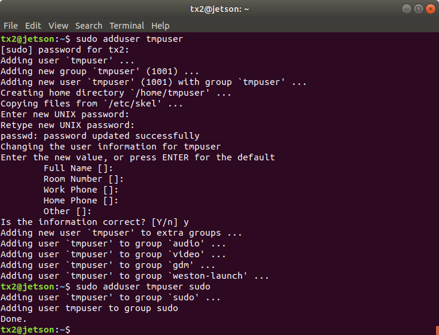
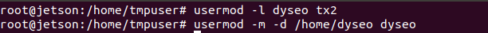
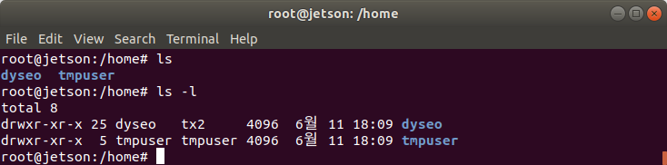
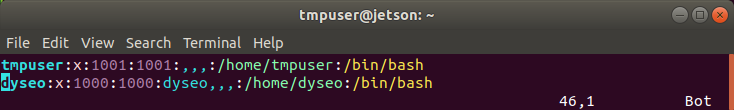

# 우분투 계정명 변경 및 부가작업
해당 글은 아래 링크를 참조하였습니다.  
우석님 블로그: https://xevolts.tistory.com/10

로컬 데스크탑에서 `ssh`로 작업중인 Jetson TX2의 우분투 초기설정을 너무 대충해서
계정명을 바꿀 필요가 있다고 판단했습니다. 

##1. 새로운 임시 유저 생성
만약 지금 현재 `ssh`로 로그인되어 있는 계정을 바꾼다 그러면 임시유저를 만들어야 합니다. 
그 임시 유저 계정에서 수퍼유저의 권한을 이용하여 기존의 바꾸려는 계정을 조정 할 수 있습니다.
- `tmpuser` 라는 이름의 임시 계정을 만들고 sudo 권한을 부여하겠습니다.
```shell script
sudo adduser tmpuser
sudo adduser tmpuser sudo
```
- 아래와 같이 결과가 나옵니다. 현재 저의 우분투 계정명은 'tx2'로 설정되어 있습니다.
  
<br>  
- 로그 아웃 후에 다시 `tmpuser` 계정으로 로그인 합니다. 

##2. root 계정으로 변경 후 사용자 이름 변경
- root 계정으로 들어가줍니다.
```shell script
su root
```
- 새로운 사용자 이름으로 바꾸어줍니다.
```shell script
usermod -l <new_username> <old_username>
usermod -l /home/<new_username> <new_username>
```
ex)  

##3. 소유권한 정리
해당 상태에서 루트 홈 디렉토리로 가서 있는 홈 디렉토리들을 자세히 살펴보면 뭔가 이상합니다.
`tmpuser` 는 그렇다치고 저의 구 `tx2`계정과 새로만든 `dyseo` 계정의 소유권한이 
섞여있는 것을 볼 수 있습니다.

- 그룹명도 변경해줍니다.
```shell script
groupmod -n <new_username> <old_username>

ex) groupmod -n dyseo tx2
```

##4. 계정 확인
- 수퍼유저를 `exit` 로 나와서 바꾼 게정을 확인해봅니다.
- /etc/passwd 파일을 열어보면 최하단부에 현재 있는 계정을 확인할 수 있습니다.

  - 저는 현재 tmpuser로 로그인 되어 있고 기존 'tx2' 계정을 'dyseo' 계정으로 바꿔주었습니다.


##5. 임시 계정 삭제
- 임시유저 게정을 삭제하기 위해서는 다시 본래의 계정으로 로그인합니다.
- 수퍼유저 권한으로 `userdel` 명령어를 써서 임시계정을 삭제합니다.
  - `-rf` 옵션을 추가적으로 주어 홈 디렉토리도 같이 지워줍니다.
```shell script
sudo userdel -rf <임시유저이름>

ex) sudo userdel -rf tmpuser
```

- `/etc/passwd` 파일을 다시 `vi` 나 `gedit`으로 열어 확인해보면 
우리가 임시로 만들었던 'tmpuser' 가 없어진 것을 확인할 수 있습니다.


