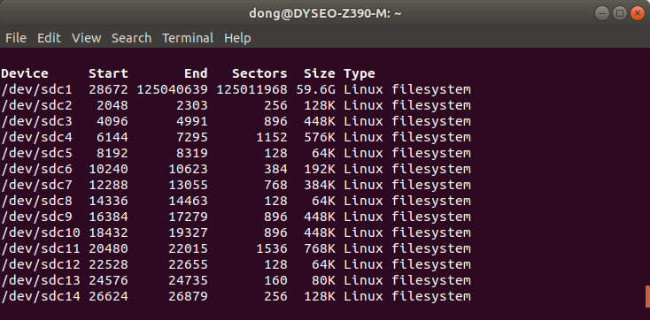
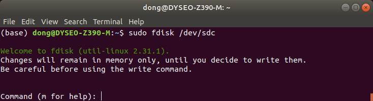
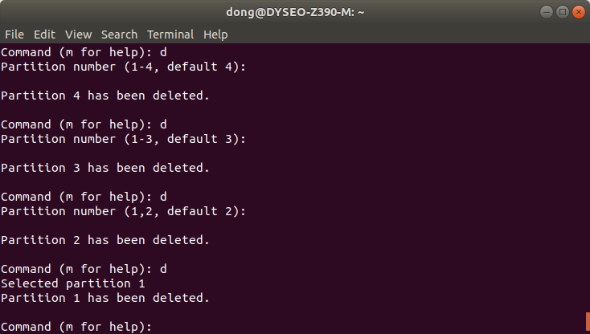
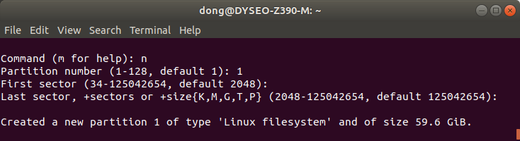
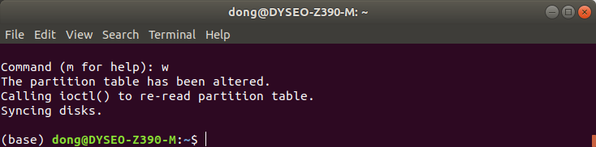

# 리눅스에서 SD카드 포맷하기
우선 USB 아답터 등을 이용해서 PC가 인식할 수 있는 상태로 유지합니다.  
순서는 아래와 같습니다.  

   1. PC에 인식해서 장치 이름 확인
   2. 언마운트 작업
   3. 원하는 형식으로 포맷

## 1. PC에 인식해서 장치 이름 확인
터미널에 아래 스크립트 입력
```shell script
sudo fdisk -l
```

결과 확인, `/dev/sdc<n>`, `/dev/sdb<n>` 등등. 
- PC에 마운트 되어있는 저장 장치의 상황에 따라서 `/dev/sdb` `dev/sdc` 등
다른 알파벳이 나올 수 있습니다.
- 혹시나 SD카드에 라즈베리파이의 라즈비안, Nvidia Jetson의 Jetpack을
설치했다면 결과창에 `n`이 여러개 나올 수 있습니다.

  - 저의 경우에는 1번 부터 14번까지 만들어져 있습니다.  

## 2. SD카드 연결 후 언마운트(Umount)
USB 아답터 등을 사용하여 PC인식을 확인했다면 1차례 언마운트 작업을 해줍니다.
후에 파티션 작업 시 사용중 에러를 일으키지 않기 위함입니다.
```shell script
umonut /dev/sdc
```

----------------------------------------------------
## 3.1. 여러개로 나뉘어진 SD카드 파티션 삭제
- fdisk 진입(예시는 `/dev/sdc`로 진행하겠습니다.)
  ```
  sudo fdisk /dev/sdc
  ```
    
- Command 입력창이 뜨면 d(Delete 커맨드) 입력
  
- `d` 입력 후에 나눠진 파티션 중에 몇번 파티션을 지울건지 입력합니다.  
  
- 저는 14개를 다 지우기 위하여 지속적으로 `d` 와 `enter`키를 눌러 다 지웠습니다.

## 3.2. 여러개로 나뉘어진 SD카드 파티션 합치기
- 3.1.에 이어서 `n` 커맨드를 이용하여 파티션을 합쳐줍니다.
  
  - 해당 내용은 파티션 번호 / 시작 섹터 / 마지막 섹터 설정이고 전부 디폴트 값으로 진행 해주었습니다.

- `w` 커맨드를 이용하여 지금까지의 작업내용을 저장합니다.
  
  
## 3.3. 원하는 포맷 형식으로 포맷하기
- 저는 추후 Jetpack을 플래싱 할 예정이라 exfat 형식으로 포맷하도록 하겠습니다.
```shell script
sudo mkfs.exfat /dev/sdc1
```  
  - 3.2.에서 sdc1 이 아닌 다른 알파벳 혹은 파티션 번호를 주었다면 그에 맞게 입력하면 됩니다.
